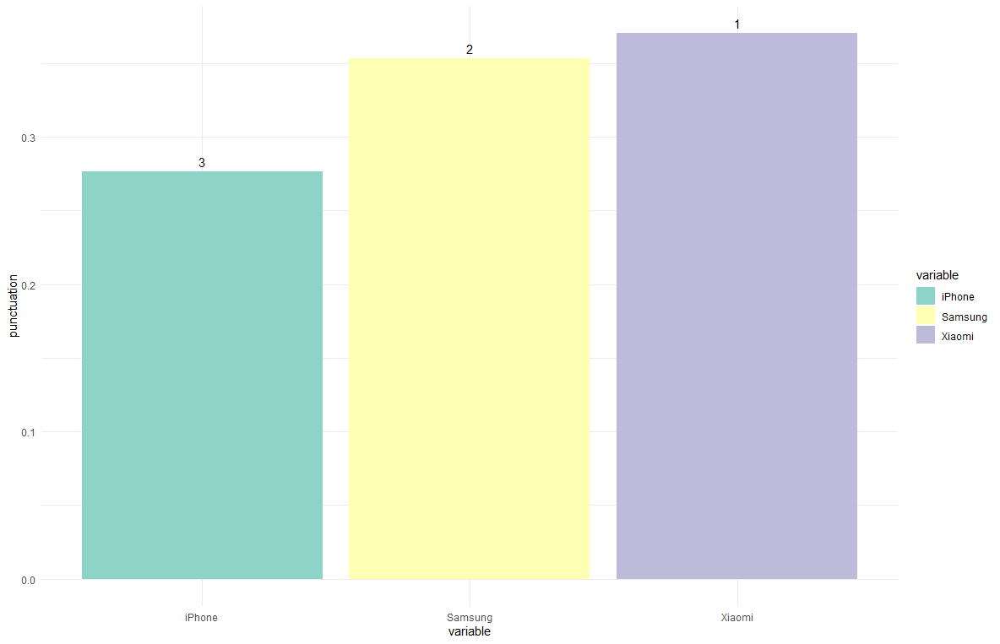

# AHPGaussian

<!-- badges: start -->

[](https://CRAN.R-project.org/package=AHPGaussian)

<!-- badges: end -->

The AHPGaussian package provides functions for performing the Analytic Hierarchy Process (AHP) using a Gaussian-based approach. AHP is a widely used decision-making method that helps to prioritize alternatives based on a set of criteria. This package implements the AHP method using Gaussian normalization to derive the relative weights of the criteria and alternatives. It also includes functions for visualizing the AHP results and generating graphical outputs.

## Installation

You can install the development version of ahpgaussian from [GitHub](https://github.com/) with:

``` r
# install.packages("AHPGaussian")
# or
# install.packages("devtools")
devtools::install_github("cidedson/ahpgaussian")
```

## Example

This is a basic example which shows you how to solve a common problem:

``` r
library(AHPGaussian)
```

``` r 
data(cellphones)

cellphones 

#       criteria Xiaomi Samsung iPhone min_max
# 1        Price   1500    1800   5000     min
# 2       Camera     12      12     20     max
# 3      Storage     64     128    128     max
# 4 Battery Life     24      18     10     max
# 5       Weight     94     120    117     min
```

``` r
cp <- ahpgaussian(cellphones)
```

``` r
summary(cp, TRUE)
#Summary of AHP Gaussian
#
#- Table1 (normalized data)
#       criteria min_max variable        value          sum      norm      mean         sd    factor
# 1         Price     min   Xiaomi 6.666667e-04 1.422222e-03 0.4687500 0.3333333 0.17140086 0.5142026
# 2         Price     min  Samsung 5.555556e-04 1.422222e-03 0.3906250 0.3333333 0.17140086 0.5142026
# 3         Price     min   iPhone 2.000000e-04 1.422222e-03 0.1406250 0.3333333 0.17140086 0.5142026
# 4        Camera     max   Xiaomi 1.200000e+01 4.400000e+01 0.2727273 0.3333333 0.10497278 0.3149183
# 5        Camera     max  Samsung 1.200000e+01 4.400000e+01 0.2727273 0.3333333 0.10497278 0.3149183
# 6        Camera     max   iPhone 2.000000e+01 4.400000e+01 0.4545455 0.3333333 0.10497278 0.3149183
# 7       Storage     max   Xiaomi 6.400000e+01 3.200000e+02 0.2000000 0.3333333 0.11547005 0.3464102
# 8       Storage     max  Samsung 1.280000e+02 3.200000e+02 0.4000000 0.3333333 0.11547005 0.3464102
# 9       Storage     max   iPhone 1.280000e+02 3.200000e+02 0.4000000 0.3333333 0.11547005 0.3464102
# 10 Battery Life     max   Xiaomi 2.400000e+01 5.200000e+01 0.4615385 0.3333333 0.13507248 0.4052175
# 11 Battery Life     max  Samsung 1.800000e+01 5.200000e+01 0.3461538 0.3333333 0.13507248 0.4052175
# 12 Battery Life     max   iPhone 1.000000e+01 5.200000e+01 0.1923077 0.3333333 0.13507248 0.4052175
# 13       Weight     min   Xiaomi 1.063830e-02 2.751864e-02 0.3865852 0.3333333 0.04628057 0.1388417
# 14       Weight     min  Samsung 8.333333e-03 2.751864e-02 0.3028250 0.3333333 0.04628057 0.1388417
# 15       Weight     min   iPhone 8.547009e-03 2.751864e-02 0.3105898 0.3333333 0.04628057 0.1388417
# 
# - Table2 (normalized factors)
# # A tibble: 5 × 2
#   criteria     factor
#   <chr>         <dbl>
# 1 Price        0.299 
# 2 Camera       0.183 
# 3 Storage      0.201 
# 4 Battery Life 0.236 
# 5 Weight       0.0807
# 
# - Table3 (final ranking)
# # A tibble: 3 × 3
#   variable punctuation  rank
#   <chr>          <dbl> <int>
# 1 Xiaomi         0.370     1
# 2 Samsung        0.353     2
# 3 iPhone         0.276     3
```


```r
plot(cp)
```


## References

dos Santos, M, Costa, I. P. de A., & Gomes, C. F. S. (2021) Multicriteria decision-making in the selection of warships: a new approach to the ahp method. International Journal of the Analytic Hierarchy Process, 13(1). <https://doi.org/10.13033/ijahp.v13i1.833>
